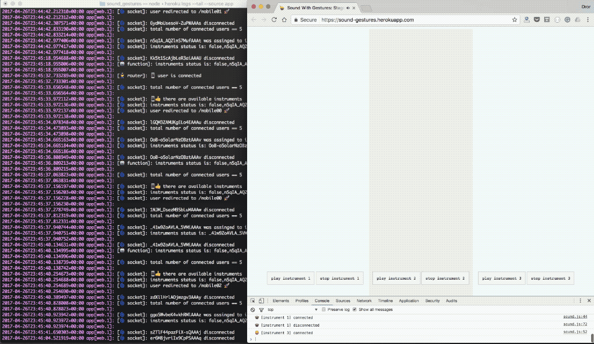

# Sound with Gestures
A web application that uses mobile devices as musical instrument.

#### Instructions:
1. On you desktop computer, go to -  
[sound-gestures.herokuapp.com](sound-gestures.herokuapp.com).
This is the stage, from which the sound will be played.

1. Go to the [same URL](sound-gestures.herokuapp.com) on your mobile device.
You mobile device sends musical notation using its gyroscope. Move the device to change the sound.

😎
